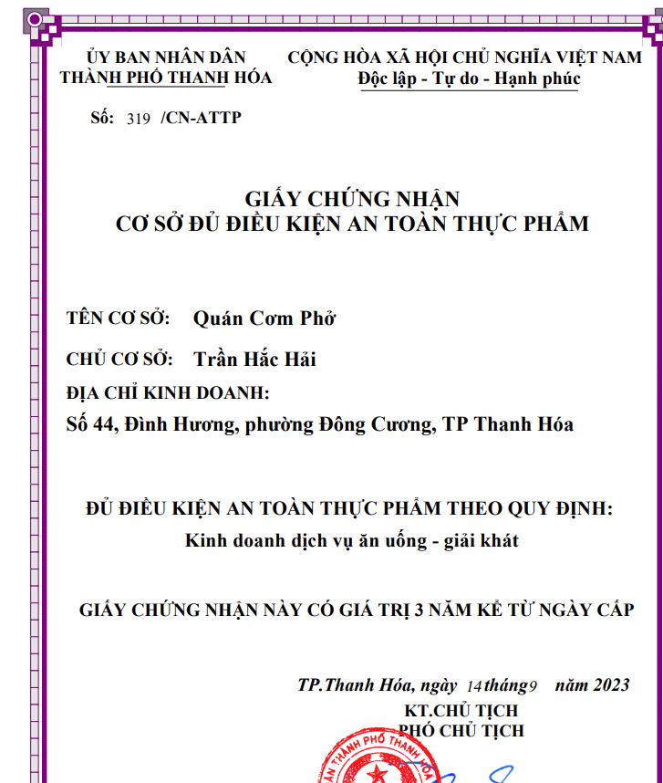
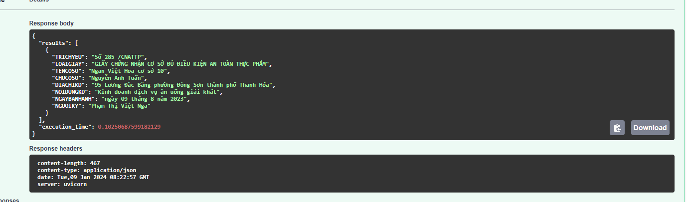

# Extract-information-from- Giấy chứng nhận đủ điều kiện an toàn thực phẩm-PTVN
The project uses Pymupdf and Ner for extract information pdf text




Dưới đây là một ví dụ README hướng dẫn chạy API này:

# Hướng dẫn chạy API

## Cài đặt

1. Cài đặt Python (phiên bản 3.7 trở lên).

2. Cài đặt các thư viện cần thiết bằng lệnh sau:

   ```bash
   pip install requirements.txt
   ```

## Chạy API

1. Clone repository từ GitHub:

   ```bash
   git clone https://github.com/Nguyendai202/Extract-information-from-pdf-text_02.git
   ```

2. Di chuyển vào thư mục chứa mã nguồn:

   ```bash
   cd your-repo
   ```

3. Chạy API bằng lệnh sau:

   ```bash
   python fast_api.py
   ```

4. API sẽ chạy trên `http://192.168.2.100:8000`.

   
   

5. Sau khi ấn Choose File, nhập file của bạn vào và ấn Execute thì lướt xuống dưới sẽ có kết quả ở đây
   


## Sử dụng API

API này chỉ có một endpoint `/docs` nhận một hoặc nhiều văn bản pdf làm tham số đầu vào.


### Request

- Phương thức: POST
- Endpoint: `http://192.168.2.100/docs`
- Header: không yêu cầu
- Body:
  - Loại: form-data
  - Key: `pdf`
  - Value: văn bản cần xử lí

### Response

Loại: String


